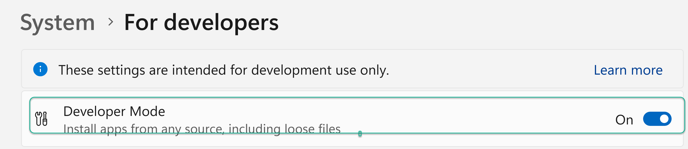

# embedder

Create a python env and activate it

```
python -m venv .venv
.\.venv\Scripts\activate

```


Install pytorch with cuda

```
pip3 install torch torchvision torchaudio --index-url https://download.pytorch.org/whl/cu118

```

Install transformers
```
pip install transformers
```

## Windows

`huggingface_hub` cache-system uses symlinks by default to efficiently store duplicated files. To support symlinks on Windows, you either need to activate Developer Mode or to run Python as an administrator. In order to see activate developer mode, see this article: https://docs.microsoft.com/en-us/windows/apps/get-started/enable-your-device-for-development




